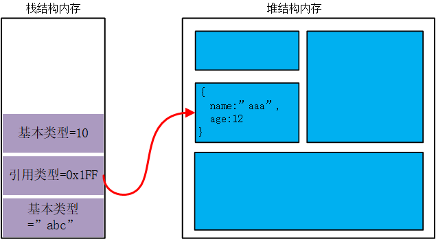

# 🚛第四章 变量、作用域、内存问题

------

## 1.基本类型和引用类型

基本类型：

-   声明变量`=>`开辟一段栈内存空间（声明变量实际上就是声明了某个寄存器）
-   值`=>`直接保存在栈内存中
-   操作`=>`直接操作值，实际的值

引用类型：

-   声明变量`=>`开辟一段栈内存空间
-   值`=>`保存的是一个内存地址，当前引用类型值的堆内存地址
-   操作`=>`操作的是值所指向的内存位置



### 1.1  复制变量值

-   基本类型

    ```javascript
    let a = 1
    // let b = a可以分步看成
    //1.声明一个变量，相当于在栈空间开辟一块内存
    let b;
    //2. 将a的值放入b所代表的这块内存
    b = a;
    ```

-   引用类型

    ```javascript
    let a = {name:'xxx'};
    // 分步
    //1. 声明变量，开辟内存空间
    let b;
    // 将a的值（因为是引用类型所以这里的值代表的是一个地址）
    // 把值（内存地址）放入b所代表的内存
    b = a;
    ```

从复制变量值可以看到，基本类型和引用类型的区别在于，**基本类型**复制的就是实实在在的值，而**引用类型**复制的是一个内存地址。这是因为`JS`不能直接操作内存，为了安全考虑。

==注意==：

引用类型复制时，两个变量虽然指向同一个地址，但是由于两个变量本身存在于不同栈空间里，所以修改一个变量的指向不会影响另外一个。

```javascript
function setName(obj) { // 函数调用时相当于创建了一个变量obj
  obj.name = "Nicholas"; 
  obj = new Object(); // 指向一个新的地址
  obj.name = "Greg"; 
} 
var person = new Object(); 
setName(person); 
alert(person.name); //"Nicholas" // 但是并没有改变原来对象的指向
```


### 1.2 传递参数

函数传参 等于 变量复制


函数的参数传递，实际上就是将实参的值==复制给`arguments`对象中的元素==	

可以把函数的参数看成是局部变量，运行完成后就被销毁了，除非`return`


### 1.3 检测类型

`typeof`对于==引用类型的值==判断只会返回`object`，因为所有引用类型的值都是`Object`的实例。

使用`instanceof`


```javascript
alert(person instanceof Object); // 变量 person 是 Object 吗？
alert(colors instanceof Array); // 变量 colors 是 Array 吗？
alert(pattern instanceof RegExp); // 变量 pattern 是 RegExp 吗？
```

## 2. 执行环境及作用域

### 2.1 执行环境


分为`全局执行环境`和`局部执行环境`

执行上下文(`context`)，全局作用域，每个函数也有自己的作用域，每个作用域可以访问的变量、数据包括自己的作用域和它父级、父级的父级...的数据，这些数据都存储在一个`变量对象`里。


```javascript
var color = "blue"; 
function changeColor(){ 
 var anotherColor = "red"; 
 	function swapColors(){ 
 		var tempColor = anotherColor; 
 		anotherColor = color; 
 		color = tempColor; 
 
 		// 这里可以访问 color、anotherColor 和 tempColor 
 	} 
 // 这里可以访问 color 和 anotherColor，但不能访问 tempColor 
 swapColors(); 
} 
// 这里只能访问 color 
```

### 2.2 延长作用域链

`try-catch`和`with`会临时添加变量对象在前端

```javascript
function buildUrl() { 
 	var qs = "?debug=true"; 
 		with(location){ 
 			var url = href + qs; 
 		} 
 	return url; 
} 
// 可以这么想， with不是function所以不算局部作用域，因此能url被访问到
```

### 2.3  变量声明

未使用`var`等字符声明的变量，默认为全局变量

### 2.3  查询标识符

```javascript
var color = "blue"; 
function getColor(){ 
 var color = "red"; 
 return color; 
} 
alert(getColor()); //"red" 
// 这里想要在函数内部访问全局变量color是不可能的
// 搜索标识符的时候，也就是搜索定义的时候是从自己的作用域开始向上搜索
// 而自己的作用域里面有一个标识符，所以只有这个局部变量color有效
// 想要在函数里面访问到全局变量，使用window.color，因为window是全局作用域的定级对象
// 只有使用var定义的变量才能被window访问，let定义的不行
```

## 3. 垃圾收集

js拥有自动垃圾回收机制，按照一定间隔找出不再使用的变量并释放其内存。

没用的变量会被打上标记，有两种实现策略

-   标记清除

    在变量进入环境和离开环境时分别做标记，如`反转某一位`。

    大部分浏览器都是标记清除

-   引用计数

    当声明了一个变量并将一个引用类型值赋给该变量时，则这个值的引用次数就是 1。如果同一个值又被赋给另一个变量，则该值的引用次数加 1。相反，如果包含对这个值引用的变量又取得了另外一个值，则这个值的引用次数减 1。当这个值的引用次数变成 0 时，则说明没有办法再访问这个值了，因而就可以将其占用的内存空间回收回来

>   `BOM`和`DOM`，是使用`C++`的`COM（Component Object Model，组件对象模型）`对象的形式实现的，而这个对象的回收机制就是使用的引用计数
>
>   ==所以==当循环引用时就不能释放内存

-   性能问题

    `IE`早期策略是达到固定临界值才触发垃圾收集，当有程序一直超过临界值，垃圾回收就必须一直运行，严重影响的性能。

-   管理内存

    `解除引用`：一个数据不再使用，手动赋值`null`释放引用

    ```javascript
    function createPerson(name){ 
     	var localPerson = new Object(); 
     	localPerson.name = name; 
     	return localPerson; 
    } 
    var globalPerson = createPerson("Nicholas"); 
    // 手工解除 globalPerson 的引用
    globalPerson = null; 
    ```

------

# 🤹‍♂第六章   面向对象的程序设计

------

传统面向对象的语言，都拥有`类`的概念`类 >>> 对象 >>>  实例`，而`js`没有。`ECMA`把对象定义为一个包含任意数据类型的无序集合。

## 1.属性类型

对象的属性值拥有两种属性类型。不能访问的内部值用`[[ ]]`表示

### 1. 1 数据属性：

针对对象属性来说的，包含四个特性

-   `[[configurable]]`：可定义性，1.能否通过`delete`删除该属性 2. 能否修改为访问器属性
-   `[[writable]]`：可写性，1. 能否修改属性值
-   `[[enumerable]]`：可枚举性，2. 能否通过for-in返回key
-   `[[value]]`：该属性包含的值

```javascript
let a = {
    name:'xxx'
};
Object.getOwnPropertyDescriptor(a, 'name')
// 使用object内置方法getOwnPropertyDescriptor，获取某个对象的某个属性的数据属性
```

```javascript
// configurable
delete a.name
console.log(a.name) ====> undefined
// writable
a.name = 'OOO';
console.log(a.name) ====> OOO
// enumerable
for(i in a) ====> "name"
// value
```

#### 1 修改数据属性的方法

`Object.defineProperty()`：被修改的属性所在的对象，属性名，一个描述符对象

如果没有指定某些数据属性，默认为`false`

如果设置`configurable`为`false`会导致下次重新设置失败

```javascript
Object.defineProperty(person,'job',{
    emumerable:false,//不可枚举   ======> for-in执行到job属性时会报错
    value:'singer',
    writable:false,//不可写  =====> a.job="xx" 会报错
    configurable:true
});
```

### 1.2访问器 / 存储器属性

这个属性没有包含数据值，包含的是get / set方法。

访问时触发`get`，修改时触发`set`

同样拥有四个特性：

-   `[[configurable]]`：可定义性， 1. 能否被`delete`删除 2. 能否修改特性
-   `[[enumerable]]`：枚举性， 1. 能否被for-in遍历到key值
-   `[[Get]]`：在读取属性时调用的函数，只指定get代表此属性默认为只读
-   `[[Set]]`：在写入时调用的函数

==访问器属性==不能直接定义，只能通过`Object.defineProperty()`定义。

```javascript
let a = {
    _name: 'XXX',// 必须书写下划线 表示是内部属性只能通过 对象的方法 来读写
    age: 12
}
// 将属性_name定义为访问器属性
Object.defineProperty(a, 'name', {
    get() {
        return this._name
    },
    set(newName) { // set传入一个参数 即新值
        if(newName !== this._name) {
            this._name = newName;
        }
    }
})
// 第二种定义方法
let a = {
    age:12,
    get _name() {
        return this._name
    }
    set _name(newName) {
    	if(newName !== this._name) {
            this._name = newName;
        }
	}
}
```

### 1.3 使用情况

-   需要设置一个属性的同时要改变其他属性值
-   监听数据变化，类似`vue`

### 1.4 定义多个属性

`Object.defineProperties()`

```javascript
var book = {}; 
Object.defineProperties(book, { 
     _year: { 
     	value: 2004 
     }, 
 
     edition: { 
     	value: 1 
     }, 
     year: { 
     	get: function(){ 
            return this._year; 
 		}, 
 		set: function(newValue){ 
 			if (newValue > 2004) { 
 				this._year = newValue; 
 				this.edition += newValue - 2004; 
 			} 
 		} 
 	}	 
}); 
```

## 2. 创建对象

使用`Object`构造函数或者字面量创建对象==缺点==

-   创建一个属性方法相似的对象会产生大量重复代码

### 2.1  工厂模式

-   每次都实例一个`Object`
-   创建的对象都是拥有相同属性的，只是值不同

```javascript
function createPerson(name, age, job){ 
     var o = new Object(); 
     o.name = name; 
     o.age = age; 
     o.job = job; 
     o.sayName = function(){ 
        alert(this.name); 
     }; 
     return o; 
} 
// 注意这里没有使用new操作符
var person1 = createPerson("Nicholas", 29, "Software Engineer"); 
```

==缺点==：如上述例子，所有对象的类型都是`Object`，不能实现区分

### 2.2 构造函数模式

-   没有显示地创建对象

-   属性和方法给了`this`对象

-   没有`return`

    这样创建的对象既是`Object`的实例也是`Person`的实例，实现了区分不同类型的对象

```javascript
function Person(name, age, job){ 
     this.name = name; 
     this.age = age; 
     this.job = job; 
     this.sayName = function(){ 
        alert(this.name); 
     }; 
} 
var person1 = new Person("Nicholas", 29, "Software Engineer"); 
var person2 = new Person("Greg", 27, "Doctor"); 
```

`new`过程：

1.  创建一个新对象
2.  `this`指向新对象
3.  执行构造函数代码，给新对象添加属性
4.  返回新对象

#### 1. 构造函数当做函数

```
构造函数和普通函数的区别只是调用方法不同。

```

```javascript
// 当作构造函数使用
var person = new Person("Nicholas", 29, "Software Engineer"); 
person.sayName(); //"Nicholas" 

// 作为普通函数调用
Person("Greg", 27, "Doctor"); // 添加到 window 
window.sayName(); //"Greg" 


// 在另一个对象的作用域中调用
// 这个例子相当于new的执行步骤
var o = new Object(); 
Person.call(o, "Kristen", 25, "Nurse"); 
o.sayName(); //"Kristen" 
```

#### 2. 构造函数的问题

==缺点==：对于方法，因为函数本身也是对象，所以每次`new`一个对象的时候，里面的方法也会实例一次，对于执行同样功能的函数，多次实例化没有必要。

将函数声明（实例函数对象）放在构造函数外，可以解决这个问题

```javascript
function Person(name, age, job){ 
     this.name = name; 
     this.age = age; 
     this.job = job; 
     this.sayName = sayName; 
} 
function sayName(){ 
     alert(this.name); 
} 
var person1 = new Person("Nicholas", 29, "Software Engineer"); 
var person2 = new Person("Greg", 27, "Doctor"); 
```

==缺点==：表面看这个函数是全局的，但是只能由某个对象调用，写在构造函数外毫无封装性。

### 2.3 原型模式

```
每个**函数**都有一个`prototype`属性，这个属性是一个`指针`，指向原型对象，**原型对象**包含实例所共享的所有属性和方法。

```

```javascript
function Person(){ 
} 
Person.prototype.name = "Nicholas"; 
Person.prototype.age = 29; 
Person.prototype.job = "Software Engineer"; 
Person.prototype.sayName = function(){ 
 alert(this.name); 
}; 
var person1 = new Person(); 
person1.sayName(); //"Nicholas" 
var person2 = new Person(); 
person2.sayName(); //"Nicholas" 
alert(person1.sayName == person2.sayName); //true 
```

#### 1. 理解原型对象

1.  只要创建了函数，就会创建一个`prototype`属性

2.  `prototype`默认会拥有一个`constructor`属性

3.  `prototype`属性是一个指针，指向`原型对象`。

4.  `constructor`属性也是一个指针，指向包含`prototype`属性的函数。

5.  每个实例有一个无法被访问的属性`[[prototype]]`，浏览器里显示为`_proto_`或者`<prototype>`，这个属性也是一个指针，指向`原型对象`，不是构造函数。

    

```javascript
// 通过isPrototypeOf检查 [[prototype]]和原型对象之间的关系
alert(Person.prototype.isPrototypeOf(person1)); //true 
alert(Person.prototype.isPrototypeOf(person2)); //true 
// 通过getPrototypeOf 得到[[prototype]]值
alert(Object.getPrototypeOf(person1) == Person.prototype); //true 
alert(Object.getPrototypeOf(person1).name); //"Nicholas" 
```

当代码读取某一个属性时，先检查自身有无此属性，然后再检查原型，依次向上查找。

```javascript
function Person(){ 
} 
Person.prototype.name = "Nicholas"; 
Person.prototype.age = 29; 
Person.prototype.job = "Software Engineer"; 
Person.prototype.sayName = function(){ 
  alert(this.name); 
}; 
var person1 = new Person(); 
var person2 = new Person(); 
person1.name = "Greg"; 
alert(person1.name); //"Greg"——来自实例
alert(person2.name); //"Nicholas"——来自原型
// 因为person1自身已经可以找到name这个属性，所以就不会再往上查找了
```

就算将实例里面设置的属性值设置为`null`也不能回复访问原型的属性，只能通过`delete`删除属性才能恢复与原型的连接。

```javascript
// hasOwnProperty只返回实例属性 不返回原型属性
alert(person1.hasOwnProperty("name")); //false 
alert(person1.name); //"Greg"——来自实例
alert(person1.hasOwnProperty("name")); //true 
```

#### 2. 原型与in操作符

```javascript
// 无论来自实例还是原型都会返回true
person1.name = "Greg"; 
alert(person1.name); //"Greg" ——来自实例
alert(person1.hasOwnProperty("name")); //true 
alert("name" in person1); //true 
alert(person2.name); //"Nicholas" ——来自原型
alert(person2.hasOwnProperty("name")); //false 
alert("name" in person2); //true 
delete person1.name; 
alert(person1.name); //"Nicholas" ——来自原型
alert(person1.hasOwnProperty("name")); //false 
lert("name" in erson1) //true 
// hasPrototypeProperty只有来自原型的属性才会返回true
var person = new Person(); 
alert(hasPrototypeProperty(person, "name")); //true 
person.name = "Greg"; 
alert(hasPrototypeProperty(person, "name")); //false 
// for-in
返回所有可枚举的属性（但是开发人员自己屏蔽枚举的属性仍然可以被循环），无论在原型还是实例里面
// Object.keys() 返回对象上的所有可枚举属性
//Object.getOwnPropertyNames() 无论可否被枚举都能返回
```

#### 3. 更简洁的原型语法

```javascript
function Person(){ 
} 
// 将原型对象直接重写
Person.prototype = { 
    name : "Nicholas", 
    age : 29, 
    job: "Software Engineer", 
    sayName : function () { 
        alert(this.name); 
    } 
}; 
// 通过字面量创建对象 相当于new Object()
// 这样原型对象成为了Object的一个实例
// 而prototype指向了原型对象(一个Object的实例)
// 包含prototype属性的函数变成了Object的构造函数
// 相当于跟着原型对象走
// constructor 指向了包含prototype属性的函数

var friend = new Person(); 
alert(friend instanceof Object); //true 
alert(friend instanceof Person); //true 
alert(friend.constructor == Person); //false 
alert(friend.constructor == Object); //true 

// 可以单独设置constructor属性
function Person(){ 
} 
Person.prototype = { 
  constructor : Person, 
  name : "Nicholas", 
  age : 29, 
  job: "Software Engineer", 
  sayName : function () { 
  alert(this.name); 
  } 
}; 
```

#### 4. 原型的动态性

```javascript
var friend = new Person(); 
Person.prototype.sayHi = function(){ 
  alert("hi"); 
}; 
friend.sayHi(); //"hi"（没有问题！）

// 这样就会报错
function Person(){ 
} 
var friend = new Person(); 
// 完全重写原型
Person.prototype = { 
  constructor: Person, 
  name : "Nicholas", 
  age : 29, 
  job : "Software Engineer", 
  sayName : function () { 
  	alert(this.name); 
  } 
}; 
friend.sayName(); //error 
```

1.  实例的`[[prototype]]`属性指向原型对象
2.  ==注意==`[[prototype]]`只是一个指针，指向一块内存，而非副本
3.  所以 当完全重写原型的时候，相当于`new Object()`，相当于重新开辟了一块内存，所以原始的`[[prototype]]`指向的内存位置将不再正确。
4.  所以检查原型链的时候，无法查找到`syaName()`这个方法。

#### 5. 原生对象的原型

#### 6. 原型对象的问题

```
构造函数不能传递参数

所有的属性都是共享的

```

### 2.4 组合构造函数和原型模式

```javascript
function Person(name, age, job){ 
  this.name = name; 
  this.age = age; 
  this.job = job; 
  this.friends = ["Shelby", "Court"]; 
} 
Person.prototype = { 
  constructor : Person, 
  sayName : function(){ 
  	alert(this.name); 
  } 
} 
var person1 = new Person("Nicholas", 29, "Software Engineer"var person2 = new Person("Greg", 27, "Doctor"); 
person1.friends.push("Van"); 
alert(person1.friends); //"Shelby,Count,Van" 
alert(person2.friends); //"Shelby,Count" 
alert(person1.friends === person2.friends); //false 
alert(person1.sayName === person2.sayName); //true 
```

### 2.5 动态原型模式

```
前面说过构造函数模式有个缺点，实例对象的时候，其中的方法每次都会实例一次，因为函数也是对象。

这里增加了一个判断，检查原型里面有没有这个方法，只需要检查一个就行了，已经有了就不用再实例这个函数了。

```

```javascript
function Person(name, age, job){ 
  //属性
  this.name = name; 
  this.age = age; 
  this.job = job;
  //方法
  if (typeof this.sayName != "function"){ 
 	Person.prototype.sayName = function(){ 
        alert(this.name); 
	 }; 
   } 
} 
```

### 2.6 寄生构造函数模式

```javascript
function Person(name, age, job){ 
  var o = new Object(); 
  o.name = name; 
  o.age = age; 
  o.job = job; 
  o.sayName = function(){ 
  	alert(this.name); 
  }; 
  return o; 
} 
// 和工厂模式唯一的不同就是 这里使用了new实例对象
// 所以Person函数不再叫包装函数 叫构造函数
var friend = new Person("Nicholas", 29, "Software Engineer"); 
friend.sayName(); //"Nicholas" 
```

构造函数如果不写返回值，默认在`new`之后返回新对象的实例。这里直接返回新对象`o`，重写调用构造函数时的返回值。

```javascript
// 如果现在需要创建一个有特殊方法的数组，但是不能直接修改Array的构造函数
// 
function SpecialArray(){ 
  //创建数组
  var values = new Array(); 
  //添加值
  //push只能接受数组不能接受 arguments类数组
  // [...arguments]也可以
  values.push.apply(values, arguments); 
  //添加方法
  values.toPipedString = function(){ 
  	return this.join("|"); 
  }; 
  //返回数组
  return values; 
} 
// 实例了一个特殊的数组对象
var colors = new SpecialArray("red", "blue", "green"); 
alert(colors.toPipedString()); //"red|blue|green" 
```

寄生构造函数和对象之间没什么关系。

### 2.7 稳妥构造函数模式

```
没有公共属性，也没有`this`对象，不使用`new`调用构造函数

```

```javascript
function Person(name, age, job){ 
 	 //创建要返回的对象
  	var o = new Object(); 
  	//可以在这里定义私有变量和函数
 	//添加方法
 	o.sayName = function(){ 
 		alert(name); 
 	}; 
 	//返回对象
 	return o; 
} 
var friend = Person("Nicholas", 29, "Software Engineer"); 
friend.saName() //"Nicholas" 

// 属性name只能由saName调用
```

## 3.继承

传统OO语言中有两种继承方式，`接口继承`和`实现继承`，接口继承只继承函数签名，一个外壳，而实现继承，继承实际的方法

而`JS`只能通过原型链进行实现继承

### 3.1 原型链

```javascript
function SuperType(){ 
  this.property = true; 
} 
SuperType.prototype.getSuperValue = function(){ 
  return this.property; 
}; 
function SubType(){ 
  this.subproperty = false; 
} 
//继承了 SuperType 
SubType.prototype = new SuperType(); 
SubType.prototype.getSubValue = function (){ 
  return this.subproperty; 
}; 
var instance = new SubType(); 
alert(instance.getSuperValue()); //true 
```


如上图所示，关键在于第`11`行代码，子类的原型对象，完全等于父类的实例的原型，而实例(子类原型对象)的`[[prototype]]`指向了父类的原型对象，子类的实例中的`[[prototype]]`又指向子类的原型对象。

子类的实例`[[prototype]]`  -----> 子类的原型对象，父类的实例(子类)的原型 -----> 父类的原型对象

`getSuperValue() `方法仍然还在`SuperType.prototype `中，但 `property `则位于 `SubType.prototype `中。这是因为 `property `是一个**实例属性**，而 `getSuperValue()`则是一个**原型方法**。既然 `SubType.prototype `现在是 `SuperType`的实例，那么 `property `当然就位于该实例中了。

此外，要注意 `instance.constructor` 现在指向的是 `SuperType`，这是因为 `instance`的`[[prototype]]`指向子类的原型对象，而原型对象（父类的实例）的`[[prototype]]`指向父类的原型对象，最后在父类的原型对象中找到`constructor`属性，指向父类的构造函数。

#### 1.默认原型

```
所有函数都是`Object`的实例，都继承了`Object`。

```


#### 2. 确定原型和实例的关系

`instanceof`  `isPrototype()`

```javascript
alert(instance instanceof Object); //true 
alert(instance instanceof SuperType); //true 
alert(instance instanceof SubType); //true 
alert(Object.prototype.isPrototypeOf(instance)); //true 
alert(SuperType.prototype.isPrototypeOf(instance)); //true 
alert(SubType.prototype.isPrototypeOf(instance)); //true 
```

#### 3.谨慎定义方法

定义新方法和重写超类方法要在替换原型语句（下方代码第二行）之后

```javascript
//继承了 SuperType 
SubType.prototype = new SuperType(); 
//添加新方法
SubType.prototype.getSubValue = function (){ 
  return this.subproperty; 
}; 
//重写超类型中的方法
// 实际上就是在子类里面写一个和超类名字一样的方法
// 因为原型链查找的关系，在子类里面查找到了就不会再往超类查找了
SubType.prototype.getSuperValue = function (){ 
  return false; 
}; 

//使用字面量添加新方法，会导致替换原型代码无效
// 字面量赋值会导致子类的原型是Object的实例
// 和超类没有关系
SubType.prototype = { 
 getSubValue : function (){ 
 return this.subproperty; 
 }, 
 someOtherMethod : function (){ 
 return false; 
 } 
}; 
```

#### 4.原型链问题

==注意==前面的例子中，都是添加或修改方法，没有怎么出现修改**引用类型**值的例子，因为**引用类型**值会被所有实例共享，一个实例改变了值，也会反映到另外一个实例上。

```javascript
function SuperType(){ 
  this.colors = ["red", "blue", "green"]; 
} 
function SubType(){ 
} 
//继承了 SuperType 
SubType.prototype = new SuperType(); 
var instance1 = new SubType(); 
// 修改引用类型数组的值
instance1.colors.push("black"); 
alert(instance1.colors); //"red,blue,green,black" 
var instance2 = new SubType(); 
alert(instance2.colors); //"red,blue,green,black" 
```

还有一个问题就是，不能在不影响其他实例的情况下，向超类传递参数。

### 3.2 借用构造函数

为了解决**引用类型**值的问题，使用借用构造（伪造对象或经典继承）。

子类构造函数内部调用超类构造函数。

==为什么使用call/apply==，因为每个子类实例都应该有自己的，来自超类的属性`colors`，所以（将来）每次调用超类构造函数，应该是在当前实例的环境下。

```javascript
function SuperType(){ 
  this.colors = ["red", "blue", "green"]; 
} 
function SubType(){ 
  //继承了 SuperType 
  SuperType.call(this); 
} 
var instance1 = new SubType(); 
instance1.colors.push("black"); 
alert(instance1.colors); //"red,blue,green,black" 
var instance2 = new SubType(); 
alert(instance2.colors); //"red,blue,green" 
```

借用构造函数可以向超类传递参数

```javascript
function SuperType(name){ 
  this.name = name; 
} 
function SubType(){ 
  //继承了 SuperType，同时还传递了参数
  SuperType.call(this, "Nicholas"); 
  
  //实例属性
  this.age = 29; 
} 
var instance = new SubType(); 
alert(instance.name); //"Nicholas"; 
alert(instance.age); //29 
```

==缺点==：

所有方法都需要在构造函数中定义。

超类在原型中定义的方法，子类是不可见的。因为实例的是子类对象，只是借用了超类的构造函数，偷偷得到了超类的属性，所以实例的`[[prototype]]`不指向超类而是指向子类的原型对象。

### 3.3 组合继承

将原型链和借用构造函数的技术组合在一块。用原型链继承方法，用借用构造函数继承属性。

```javascript
function SuperType(name){ 
  this.name = name; 
  this.colors = ["red", "blue", "green"]; 
} 
SuperType.prototype.sayName = function(){ 
  alert(this.name); 
}; 
function SubType(name, age){ 
  //继承属性
  SuperType.call(this, name); 
  this.age = age; 
} 
//继承方法
SubType.prototype = new SuperType(); 
SubType.prototype.constructor = SubType; 
SubType.prototype.sayAge = function(){ 
  alert(this.age); 
}; 
var instance1 = new SubType("Nicholas", 29); 
instance1.colors.push("black"); 
alert(instance1.colors); //"red,blue,greeninstance1.sayName(); //"Nicholas"; 
instance1.sayAge(); //29 
var instance2 = new SubType("Greg", 27); 
alert(instance2.colors); //"red,blue,greeninstance2.sayName(); //"Greg"; 
instance2.sayAge(); //27 
```

### 3.4 原型式继承

使用一个模板对象，继承，不需要构造函数

```javascript
 // 在object函数里面定义一个临时的函数
// 这个临时函数的原型被完全重写成模板对象
// 最后返回这个临时函数的实例。
// 本质就是一次浅复制
function object(o){ 
  function F(){} 
  F.prototype = o; 
  return new F(); 
}
// 所有的属性都是共享的 修改一个就会影响其他的
```

`Object.creat()`就是基于此

```javascript
var person = { 
  name: "Nicholas", 
  friends: ["Shelby", "Court", "Van"] 
}; 
var anotherPerson = Object.create(person); 
anotherPerson.name = "Greg"; 
anotherPerson.friends.push("Rob"); 
  
var yetAnotherPerson = Object.create(person); 
yetAnotherPerson.name = "Linda"; 
yetAnotherPerson.friends.push("Barbie"); 
alert(person.friends); //"Shelby,Court,Van,Rob,Barbie" 
// 第二个参数
var anotherPerson = Object.create(person, { 
  name: { 
  	value: "Greg" 
  } 
}) 
```

### 3.5 寄生式继承

```javascript
function createAnother(original){ 
  var clone = object(original); //通过调用函数创建一个新对象
  clone.sayHi = function(){ //以某种方式来增强这个对象
  	alert("hi"); 
  }; 
  return clone; //返回这个对象
} 
```

### 3.6 寄生组合模式

组合继承模式有个缺点，需要调用两次超类构造函数，一次是将超类实例赋值给子类原型的时候，一次是子类构造函数内部调用了超类构造函数。

```javascript
// 1. 复制超类对象
// 2. 修改原型custuctor属性
// 3. 超类原型赋值给子类 
// 这三步相当于完成了组合继承里面的subType.prototype = new superType()，减少了一次超类构造函数调用。
function inheritPrototype(subType, superType){ 
  var prototype = object(superType.prototype); //创建对像
  prototype.constructor = subType; //增强对像
  subType.prototype = prototype; //指定对像
} 
function SuperType(name){ 
  this.name = name; 
  this.colors = ["red", "blue", "green"]; 
} 
SuperType.prototype.sayName = function(){ 
  alert(this.name); 
}; 
function SubType(name, age){ 
  SuperType.call(this, name); 
  
  this.age = age; 
} 
inheritPrototype(SubType, SuperType); 
SubType.prototype.sayAge = function(){ 
  alert(this.age); 
}; 
```

# ⚒ 第七章   函数表达式

------

```javascript
//不要这样做！ 
//大多数浏览器会返回第二个声明，忽略condition；Firefox 会在 condition 为 true 时返回第一个声明
if(condition){ 
  function sayHi(){ 
  alert("Hi!"); 
  } 
} else { 
  function sayHi(){ 
  alert("Yo!"); 
  } 
} 
//可以这样做
var sayHi; 
if(condition){ 
  sayHi = function() alert("Hi!"); 
  }; 
} else { 
  sayHi = function() alert("Yo!"); 
  }; 
} 
```

## 1. 闭包

有权访问**另一个**函数作用域中的变量的函数

下面代码，`createComparisonFunction`里面返回了一个内部匿名函数，而内部函数使用了外部参数`propertyName`，而且无论这个内部函数被返回了还是在其他地方被调用了，都可以使用这个参数`propertyName`。

其原因，因为这个内部函数的作用域中**包含**了`createComparisonFunction`作用域。

```javascript
function createComparisonFunction(propertyName)  
  return function(object1, object2){ 
      var value1 = object1[propertyName]; 
      var value2 = object2[propertyName]; 
  	  if (value1 < value2){ 
  		return -1; 
  	  } else if (value1 > value2){ 
  		return 1; 
  	  } else { 
  		return 0; 
      } 
   }; 
} 
```

### 1.1 作用域链创建 和  作用域链细节

某个函数被调用时：

1.  创建`执行环境（execution context）`和相应`作用域链`
2.  使用`arguments`和其他`命名参数`的值来初始化函数的`活动对象（activation object）`
3.  在`作用域链`中**外部**函数的活动对象处于第二位，外部的外部函数活动对象处于第三位.....直到全局作用环境

==例1：==

```
假如有个函数`compare()`，在全局的环境中调用它，作用域链如下图

```


1.  如上文所说，在调用函数时会创建一个执行环境`compare的执行环境`和一个`作用域链`
2.  其中`作用域链`在**创建的时候**就有包含`全局变量对象`，这个初始对象存在`[[Scope]]`属性中，当**调用函数时**复制`[[Scope]]`里的对象构建起当前执行环境的作用域链。
3.  然后创建一个`活动对象`，被推入作用域链前端。
4.  作用域链实际上就是一个指针列表，不包含任何对象。
5.  访问变量的时候从作用域链搜索，函数执行完毕后局部活动对象就被销毁。

==例2：==

```
以上文`createComparisonFunction()`函数为例，一个`内部函数`会将`外部函数`的活动对象添加到它的作用域中，所以`createComparisonFunction()`里的匿名函数将包含`createComparisonFunction()`的活动对象。

```


1.  首先`createComparisonFunction()`创建的作用域链过程和例1一样

2.  里面的匿名函数将包含函数，也就是`createComparisonFunction()`的`活动对象`添加到自己的作用域链里面，位置在自己的活动对象之后，全局对象之前。

3.  当`createComparisonFunction()`返回时，也就是它执行完毕时，因为内部函数，也就是匿名函数的作用域链仍然连接着`createComparisonFunction()`的活动对象，所以`createComparisonFunction()`的活动对象并不会被销毁

    ```javascript
    //创建函数
    var compareNames = createComparisonFunction("name"); 
    //调用函数
    var result = compareNames({ name: "Nicholas" }, { name: "Greg" }); 
    //解除对匿名函数的引用（以便释放内存）
    compareNames = null; 
    ```

### 1.2 闭包与变量

闭包所保存的是`变量对象`而不是某个特定的变量，如下代码

```javascript
function createFunctions(){ 
  var result = new Array(); 
  for (var i=0; i < 10; i++){ 
      result[i] = function(){ 
      return i; }; 
  } 
  return result; 
} 
// 期望输出的是一个数组，位置 0 的函数返回 0，位置 1 的函数返回 1，以此类推
```

事实上并不能达到预期，如上节所描述的，**每个内部函数**，也就是这里的匿名函数的作用域链里面**都包含外部函数**的活动对象，也就是说每个匿名函数都包含着同一个也就是`createFunctions()`的活动对象，或者说是它的**所有变量**，所以当循环完成后，都只能输出`10`

```javascript
// 使用立即执行闭包函数并将当时的变量i传入，就能正确返回
function createFunctions(){ 
    var result = new Array(); 
    for (var i=0; i < 10; i++){ 
        result[i] = function(num){ 
            return num
        }(i);
    } 
    return result; 
} 
```

### 1.3  `this`对象

```
`this`是基于函数执行环境绑定的。而匿名函数通常指向`window`，而闭包会有点不同。

```

```javascript
var name = "The Window"; // 全局变量name
var object = { 
  name : "My Object", // 对象属性name
  getNameFunc : function(){ 
  	return function(){ 
  		return this.name; 
  	}; 
  } 
}; 
alert(object.getNameFunc()()); //"The Window"（在非严格模式下）
```

```
之所以输出的是全局变量，

```

1.  每个函数被调用时，会自动取得两个变量`this`和`arguments`
2.  取得的过程就是按照前几节所叙述的作用域链顺序搜索
3.  按照之前的描述，作用域链最前端是函数自己的活动对象
4.  所以这里的匿名函数最先搜索到的`this`是自己的活动对象，也就是指向全局的`this`

```javascript
var name = "The Window"; 
var object = { 
 name : "My Object", 
 getNameFunc : function(){ 
    var that = this; // 保存外部函数的this
  	return function(){ 
 		 return that.name; // 引用外部函数的this
  	}; 
  } 
}; 
alert(object.getNameFunc()()); //"My Object" 
```

```
这里的主要操作时将外部函数的`this`保存，闭包使用了外部函数的`this`

因为内部函数，这里的闭包包含了外部函数的活动对象，所以能访问变量`that`。

`this`值有时会意外的发生改变

```

```javascript
var name = "The Window"; 
var object = { 
  name : "My Object", 
  getName: function(){ 
      return this.name; 
  } 
}; 
object.getName(); //"My Object" 
(object.getName)(); //"My Object" ()()定义和object.getName()相同
(object.getName = object.getName)(); //"The Window"，在非严格模式下
// 因为赋值是函数本身
```

### 1.4 闭包导致内存泄露

在`IE9`之前对`js对象`和`COM对象`使用不同的垃圾收集例程，所以如果闭包作用域链里面保存着一个`HTML`元素，那么该元素将无法被销毁。

```javascript
function assignHandler(){ 
  var element = document.getElementById("someElement"); 
  element.onclick = function(){ 
      alert(element.id); 
  }; 
} // 因为闭包创建了一个循环引用，匿名函数又包含着assignHandler的活动对象，所以只要匿名函数存在就永远不会被回收
```

```javascript
// 使用第四行代码消除循环引用
// 使用第十一行消除活动对象中对html元素的引用
// 因为闭包包含着外部函数的活动对象
function assignHandler(){ 
  var element = document.getElementById("someElement"); 
  var id = element.id; 
  
  element.onclick = function(){ 
  	alert(id); 
  }; 
  
  element = null; 
} 
```

## 2. 模仿块级作用域

```
`JS`中没有块级作用域的概念，如在`for`循环外也可以访问循环变量。可以使用匿名函数来模仿块级作用域。

```

```javascript
(function(){ 
  //这里是块级作用域
})();

// 相当于
let xx = function() {
    //这里是块级作用域
};
xx();
// 函数调用无非就是函数名跟着一对括号，而函数名也可以直接使用值也就是右侧代替，但是直接使用会出错，所以用括号包裹转化一下
```

```javascript
function outputNumbers(count){ 
      (function () { 
          for (var i=0; i < count; i++){ 
            alert(i); 
          } 
      })(); 
  alert(i); //导致一个错误
} 
```

```
这里使用立即执行的匿名函数包裹`for`循环，因为函数执行完成后会销毁自己的`局部活动对象`，所以当这里面的循环结束后，外面无法访问里面的变量，而又以为这个匿名函数是一个闭包，作用域包含了外部函数`outputNumbers`的活动对象，所以能访问变量`count`

```

## 3. 私有变量

任何在函数中定义的变量，都可以认为是私有变量，因为不能在函数的外部访问这些变量。私有变量包括函数的参数、局部变量和在函数内部定义的其他函数。

把**有权访问**私有变量和私有函数的公有方法称为**特权方法**`privileged method`，有两种方法

```javascript
function MyObject(){ 
  //私有变量和私有函数
  var privateVariable = 10; 
  function privateFunction(){ 
 	 return false; 
  } 
  //特权方法
  this.publicMethod = function (){ 
  	privateVariable++; 
 	 return privateFunction(); 
  }; 
} 
//变量 privateVariable 和函数 privateFunction()只能通过特权方法 publicMethod()来访问

function Person(name){ 
  this.getName = function(){ 
  	return name; 
  }; 
  this.setName = function (value) { 
  	name = value; 
  }; 
} 
var person = new Person("Nicholas"); 
alert(person.getName()); //"Nicholas" 
person.setName("Greg"); 
alert(person.getName()); //"Greg" 
```

==缺点==：

像上面代码一样使用构造函数来定义特权方法，有个缺点，就是每次实例化的时候都会创建一组新的方法，因为函数也是对象。

### 3.1 静态私有变量

```
为了解决构造函数定义特权方法的问题。在`私有作用域`中定义私有函数和变量

```

```javascript
(function(){ 
  //私有变量和私有函数
  var privateVariable = 10; 
  function privateFunction(){ 
  	return false; 
  } 
  //构造函数
  MyObject = function(){ 
  }; 
  //公有/特权方法
  MyObject.prototype.publicMethod = function(){ 
  	privateVariable++; 
  	return privateFunction(); 
  }; 
})(); 
```

这个模式中：

1.  创建了一个私有作用域，然后定义了私有属性。
2.  第八行定义一个构造函数，并使用原型模式定义了特权方法，注意这里的构造函数没有使用`var`，目的是让它成为全局变量，方便外部访问私有属性。
3.  有一个实例改变了属性，所有实例都会体现

### 3.2  模块模式

```
主要是针对单例创建私有变量和特权方法，单例就是只有一个实例的对象。

```

```javascript
// 典型的单例 字面量创建的对象
var singleton = { 
 name : value, 
 method : function () { 
 	//这里是方法的代码
 	} 
}; 
// 模块模式
var singleton = function(){  
  //私有变量和私有函数
  var privateVariable = 10; 
  
  function privateFunction(){ 
 	 return false; 
  } 
 //特权/公有方法和属性
// 返回的就是一个单例
 return { 
 	publicProperty: true, 
 	publicMethod : function(){ 
 		privateVariable++; 
 		return privateFunction(); 
 	} 
 }; 
}(); 
```

上面的代码，创建了一个匿名函数内部有私有变量和函数，然后返回一个字面量对象，包含公开的变量和方法。

这种方法对于，需要对单例进行某些初始化，同时又需要维护其私有变量时非常有用。

```javascript
// 使用例子
var application = function(){ 
  //私有变量和函数
  var components = new Array(); 
  //初始化
  components.push(new BaseComponent()); 
  //公共
  return { 
  	getComponentCount : function(){ 
  		return components.length; 
  	}, 
  	registerComponent : function(component){ 
  		if (typeof component == "object"){ 
  			components.push(component); 
 	 	} 
  	} 
  }; 
}(); 
```

如果需要对一个对象进行初始化同时需要一些公开且能够访问这些私有数据的方法，就可以使用模块模式。

### 3.3 增强模块模式

单例必须是某种类型的实例，同时还必须添加某些属性和（或）方法对其加以增强的情况

```javascript
var application = function(){ 
  //私有变量和函数
  var components = new Array(); 
  //初始化
  components.push(new BaseComponent()); 
  //创建 application 的一个局部副本
  var app = new BaseComponent(); 
  //公共接口
  app.getComponentCount = function(){ 
  	return components.length; 
  }; 
  app.registerComponent = function(component){ 
  	if (typeof component == "object"){ 
  		components.push(component); 
  	} 
  }; 
  //返回这个副本
     return app; 
}(); 
```

# 